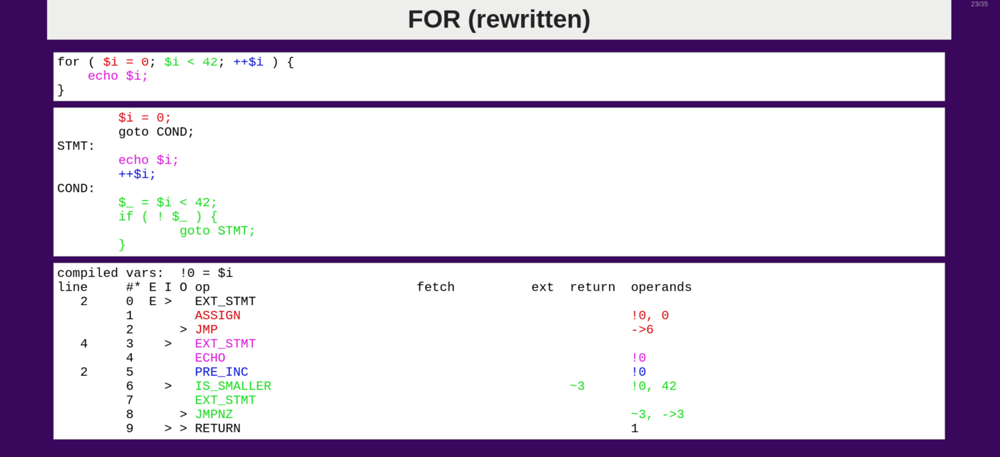

import Quote from "../../components/Quote.astro";

I’m lucky enough to have just attended the [PHP Barcelona](https://php.barcelona/) 2019 conference. The organisation is
now uploading all of the talks to Youtube. My idea here is to give you some orientation on what things are worth
watching in my opinion.

## PHP Barcelona 2019 Opening Keynote by Rasmus Lerdorf
It’s a pleasure to attend to a talk by the person who started PHP now that it is a 25-year-old language. Rasmus walked
through the story of himself –including a lot of personal photos– and PHP. His talk gave insights into some of the
defining characteristics of the language:

- He started PHP as a mere template engine for web applications made in C. However, since the emerging community of
webmasters were not C developers; and actual C developers disregarded the web as something that would fade away; there was a demand for PHP to be extended into a full language.

- PHP was not conceived to be responsible for scaling. That’s why it was designed to be used with an external server
i.e. Apache. Rasmus made very clear that he was focused on building the environment from the beginning. The LAMP stack
didn’t appear spontaneously, it was designed altogether with PHP.

- He thought that the only way to make PHP robust and safe was to avoid multi threading.

- Rasmus created the language in a way that enabled hosting providers to use it in a safe way without one application
crashing the entire system. That’s the idea behind things like execution time limits or the MySQL LIMIT clause.

Overall, the whole idea of PHP was to make a language as stupid as possible. Or, as he rather puts it:“stupidly
simple”.

### Naming Consistency
In one of the funniest moments of the talk, Rasmus stated that: “names in PHP are consistent. They just are not
consistent in the way you expect them to be”. He elaborated on this, explaining that PHP is not consistent horizontally,
but vertically. So names don’t follow the same convention across the whole language. Instead, the names in the Oracle
module, for example, are consistent with Oracle naming conventions; and the names in the MySQL module are consistent
with the MySQL naming conventions.

He then showcased some of the new features that are coming in PHP 7.4.You can see moreabout that on
[php.net](https://www.php.net/manual/en/migration74.php). As I am quite a fan of the null coalescing operator (I even
wrote [a post about it](/blog/null-coalescing-vs-elvis-operator-php/)), my personal pick is the new null coalescing
assignment operator which is going to save us a lot of space in our code.

### Build things that matter
The end of the talk was marked by an inspiring example of an application built with PHP. He showed a tool to locate
people and resources in emergency situations like natural disasters. He then exhorted the audience to build things that
matter.

Rasmus insisted on the idea that he doesn’t like programming, but giving solutions to problems. It was connected to that
he gave the best quote in the entire PHP Barcelona 2019 conference:

<Quote cite="Rasmus Lerdorf">
    I don’t care about people ranting about how bad PHP is or how stupid I am… on their WordPress blogs.
</Quote>

---

## PHP Performance Trivia
PHP Barcelona 2019 also featured to a talk by Nikita Popov, probably the most important contributor to PHP these days.
He gave a very interesting presentation on how to optimise performance, building up on some of the concepts regarding
Opcache that Rasmus had explained before. You should definitively watch the entire talk, but here are a few takeaways:

- If you are storing data within your code, the best thing you can do is to make sure to include it in a separate file
that returns it (Is there a technical name for this php files that begin with return; and some value? Please let me know
in the comments if you know it). That way ensures that Opcache caches your data.

- If you have data with defined properties, always use objects with a class. If you have to add data dynamically, use
arrays. That actually makes sense intuitively and doing the opposite has a very bad in performance.

- Type declarations are expensive in PHP, since it is not a compiled language and those types have to be checked at
runtime. However, that means that core contributors are very careful when adding new type declarations in new places.
For most cases, you definitely should use them as the impact is negligible.

- Try to avoid callbacks as much as possible. A foreach() loop may be a better idea than an array_map() in terms of
performance.

---

## How Stuff Works
The talk by Derick Rethans (known among other things for being the creator of Xdebug) was absolutely fascinating. It
gave a lot of insights on something that we don’t usually think about: How does the machine actually process our code?

Derick showed how the compiler parses and translates your code into bytecode (called opcode in PHP) in a very clear and
mind-blowing way. The talk title was ‘It’s all about the goto’ and my favourite slide of the presentation shows why that
is, indeed, the case:

[© 2019 Derick Rethans](https://derickrethans.nl/talks/jump-bcn19). Please note that there is a typo in the
second snippet; it should be `if ( $_ ) {` instead of `if ( ! $_ ) {`

As you can see, the first snippet is a super-simple for loop. The second is that same loop rewritten with goto
statements. (Note: this is just for explanation purposes. If there is a well established principle in programming is
that the goto statement is harmful. Please never use it)

The box at the bottom is a visualisation of the actual bytecode that the loop generates. If you pay attention, you’ll
see that it closely resembles our goto version of it.

That is one of the best presentations on how code actually works that I’ve seen, and one of my personal favorites of
PHP Barcelona 2019.

---

## Developing Cacheable PHP Applications
The insights given in this talk by Thijs Feryn were absolutely remarkable. Feryn, who works for Varnish, showed how you
can do amazing things in the caching layer, removing a lot of workload from your application servers.

He first went through more basic stuff (making sure that you’re application stops processing a request as soon as it
finds a valid cached version; serving as much cached content as you can by retrieving small dynamic sections –like a
header with user info– from generally static pages via AJAX or Edge-Side Includes).

However, the truly amazing things were in the second half of the talk. He showed how to use Varnish with VCL
configurations to cache things you thought you couldn’t cache. For example, if you already have validated a session
token, you can store that at the caching layer without having to make a time-wasting and resource-consuming call to
your main application server. Or, you can use Varnish to fill in directly to fill template files like .twig. Truly
magic, heh?

Well, it’s not magic, but it’s also not free. If there’s something that upset the audience is that it was only after
showing us those jaw-dropping possibilities that he told us that they were only available on the enterprise version of
Varnish. Hey, I have nothing against promoting your products, being this a conference for whose tickets we all had to
pay a fee, but you should be upfront and transparent about it from the beginning.

---

## Nuclear Powered Software Security
Chris Riley spoke about security adding a very personal perspective to the matter. His first advice was to simply
forget about lists like OWASP 10. The problem with lists is that, after going through all its items, you can feel that
you’re alright without considering which may be the biggest threats. For example, social engineering is not, and cannot
be by its very nature, part of any list.

Instead, Riley draw an analogy with a nuclear power plant. When designing a reactor, what you do to make it as safe as
possible is considering which things can go wrong to make it fail, identifying single points of failure and possible
error combinations.

I think it was a very refreshing approach to security and a very common sense way to think about it.

---

## Common Themes During PHP Barcelona 2019
There were two topics that acted as the leitmotiv of many talks. They represent two buzzwords in the height of fashion:
asynchronicity and microservices.

### Asynchronous PHP
I should probably write a full post on using PHP asynchronously. Personally, I don’t think it’s a good idea or even
necessary at all.

As we’ve seen, PHP is synchronous by design. Swoole and ReactPHP don’t do anything that languages that are asynchronous
by design, like Node.js can’t do. In fact, all of the talks that covered the subject mentioned that you could do this
or that just like in Node.

And besides, they are so different from any standard PHP application that migration is impossible without having to
rewrite the whole codebase. There is no inherited advantage in using PHP.

Anyway, if the concept interests you, you’ll probably like to check out the talk by Albert Casademont, “Supercharge
your apps with ReactPHP & PHP-PM”.

Oddly enough, php.barcelona 2019 also featured a talk about Go (Golang), given by Kat Zień from Monzo. I would say
that if you need an asynchronous app, using Go is a far better option than forcing PHP into it.

One of the most remarkable facts given in this talk is that Monzo is built entirely on Go. And it’s working with
more than 1500 microservices. That sounds like a lot, and it brings us to other common topic among various of the
presentations.

### Microservices. The good, the bad and the ugly.
A few talks explored the topic of microservices in PHP, another trending topic in the software development world
nowadays.

Enrico Zimuel, from Elastic, gave a very explanatory presentation which started with a very good overview on its pros
and cons. There’s probably nothing new there, but it’s probably a very good consideration to make when making
architectural decisions, instead of picking just microservices because it’s the word of the day.

He then showed examples of a ride-sharing app written in PHP (with Swoole) using microservices, which you may like to
watch if you are considering this kind of application.

No matter which architecture you choose, a few points make a good watch for any PHP developer, particularly those about
applying PSR-7 for HTTP transactions.

A great talk on microservices was Anthony Ferrara’s, “Microservices gone wrong”. He basically brought some common sense
back into the topic, highlighting facts that should be obvious, e.g. http calls to a service are unreliable while
function calls inside a monolith are never expected to fail.

Ferrara, who is nowadays engineering manager at Facebook, based his talk on personal experience and it surely
constitutes good watching material for any developer working in a modern system.

My personal takeaway from it was this: if you are going to make microservices, make them as big as you can. It’s
always easier to split them than to combine smaller services together.

