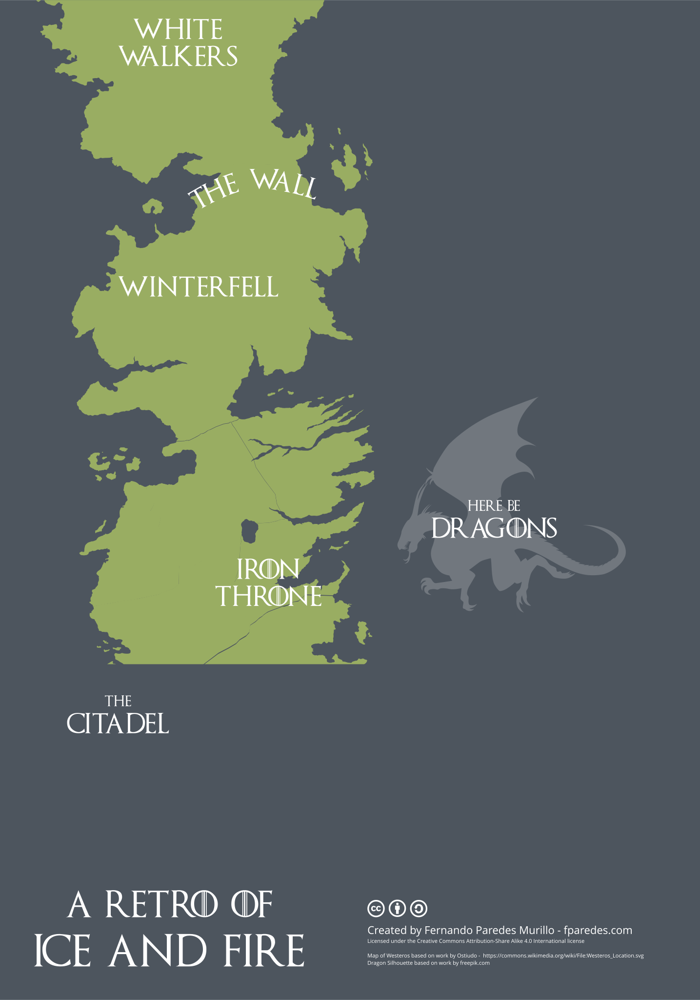

Now that Game of Thrones has ended it feels like the time to pay some tribute and create something to add a little bit
of fun to your next retrospective.

Only a little bit of familiarity with the show or the books is required to understand the references in the exercise.
For those few people that have managed to isolate themselves from the GOT cultural phenomenon, a quick explanation of
1-2 minutes is more than enough to grasp the concepts of the exercise.

So I created this retro board that combines a few things:

- A map of Westeros (threatening dragon silhouette included)
- A goal-oriented layout similar to the [Sailboat Retrospective](https://adaptmethodology.com/blog/sailboat-exercise-sailboat-retrospective/)
- An area devoted to reflect on learning, which is something that I like to have in any retrospective

## How to Use the Board
Each area has a meaning related to their role in the story of A Song of Ice and Fire. They can be grouped in three sectors:

### The Journey to Achievements
- Ask the group to use the ‘Iron Throne’ area to put their individual and team goals.
- ‘Winterfell’ is to leave a quick note on the points from where they started their journey towards achieving those
goals.
- The Dragons are the tools, processes, etc. they have used – anything that has helped achieving those goals

### Problems Are Coming
- The ‘White Walkers‘ area is where the group should reflect on the bugs or any other kind of problems (communication,
processes, etc. ) that happened during the sprint.
- ‘The Wall‘ is the place to note down the defences that have been built and the measures that have been taken to
mitigate those problems and/or prevent that they happen again

### Learning Along the Way
- The team should use ‘The Citadel’ to reflect about the things that they have learned during the iteration.

## When to Use this Exercise
This exercise is intended as a funny and different way to spice up the ‘gather the data’ phase of your agile
retrospectives.

Note that this board layout is fairly complex and is not suited for new teams, meetings where there is a significant
number of people new to the practice of retrospectives, or if you are facilitating a retro for the first time.

On the other hand, a team that has been doing retrospectives for a while will probably appreciate doing something
different.

Because it’s mainly focus relies on the goals and the journey to achieve them, it works particularly well when done
after closing major epics or projects.
